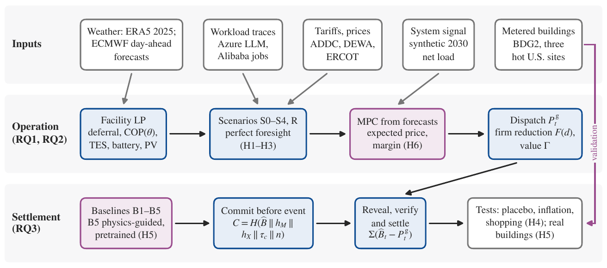
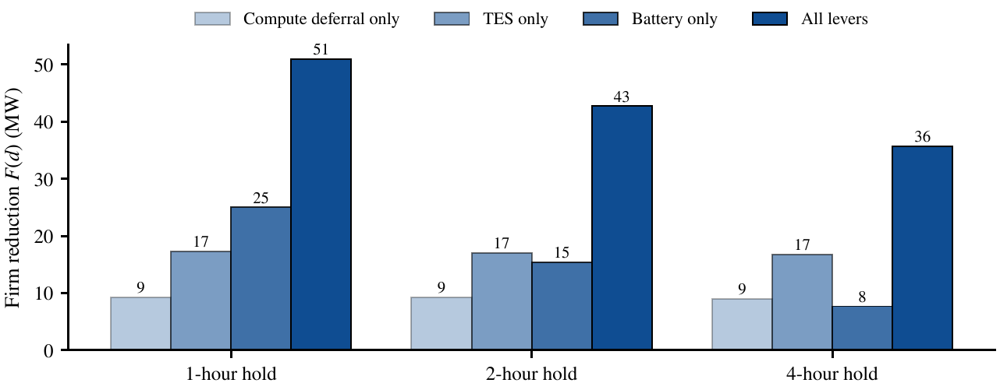
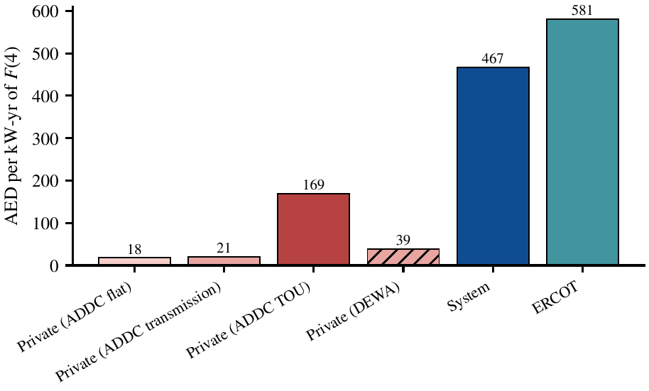
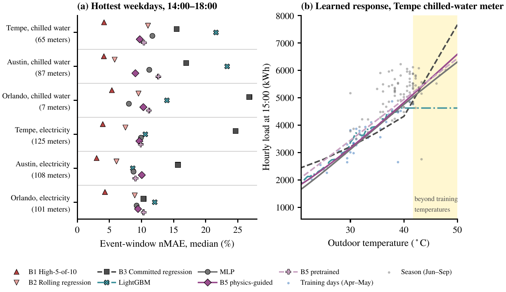
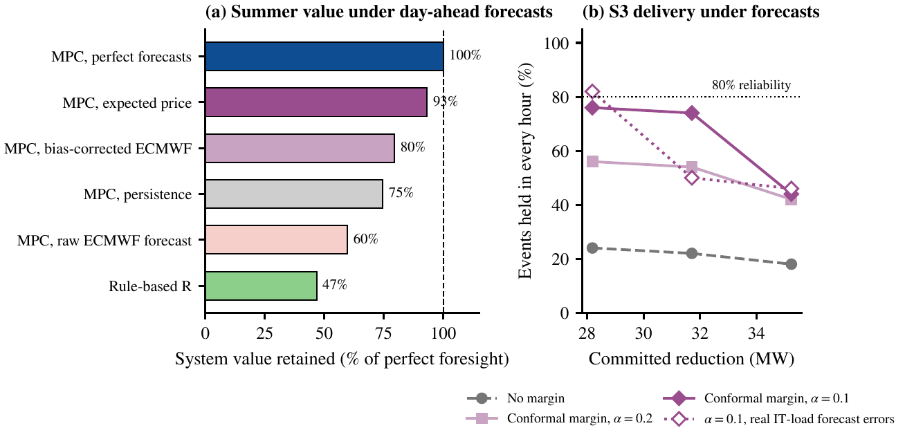

<div align="center">


# Digitized Demand Response: Maximizing Data Center Grid-Interactive Efficiency for Renewable Integration

**Yuxin Zhu, Mohamed Hammad, Budoor Alyousuf, Ghaya Alhammadi, Mohamed Almannai, Yan Guo, Shamma Bahumaid**

Young Future Energy Leaders (YFEL) Programme 2026, Group 4<br>
Khalifa University of Science and Technology, Abu Dhabi, United Arab Emirates

[](https://github.com/zhuyuxin0/dcflex/actions/workflows/tests.yml)
[](LICENSE)
[](DATA.md)
[](experiments/requirements.txt)
[](https://doi.org/10.5281/zenodo.23032876)
[](#citation)

</div>

This repository (Python package `dcflex`) holds the code, inputs, trained models and results of the paper. The paper asks how much demand response (DR) a large AI campus in Abu Dhabi can provide, what it is worth, and
how its delivery can be verified. Every number, table and data figure in the paper is produced by this code; the
release tagged `v1.0` is the one the paper reports.

<p align="center"></p>

The facility is hypothetical and the Abu Dhabi system signal is a synthetic 2030 scenario, calibrated to published
statistics. Results indicate magnitudes and directions of effect, not site-specific values.

## Headline results

- **Flexibility.** The 100 MW (IT) campus holds a four-hour reduction of 35.7 MW at 80% reliability. Under a DR contract it commits 35.2 MW, 17.6% of Abu Dhabi's 2030 DR target.
- **Value.** Current UAE tariffs reward 17.9–169.2 AED/kW-yr of flexibility whose value to the power system is 466.8 AED/kW-yr.
- **Verifiable settlement.** When the campus inflates its load before events, the conventional high-5-of-10 baseline over-credits the reduction by 57.3%; choosing a baseline after the fact over-credits by 34.4%. Baselines committed before the season with a SHA-256 commit–reveal protocol remove both gains.
- **Learned baseline on real buildings.** On 159 chilled-water meters at three hot US sites, the committed physics-guided network B5 has a median error of 9.5% on the hottest event days, against 16.9% for a committed regression and 22.2% for gradient-boosted trees; it beats the regression on 80.5% of meters.
- **Forecast-driven operation.** Controlled from real ECMWF day-ahead forecasts, the campus keeps 93.2% of its perfect-foresight system value (against 59.7% with the raw forecast). Committing 80% of its perfect-foresight reduction, with a conformal margin, it delivers in every hour of 76.0% of events (82.0% with real data-center IT-load forecast errors).

| Flexibility envelope | Private and system value |
|:---:|:---:|
|  |  |
| **Learned baselines on metered buildings** | **Operation from day-ahead forecasts** |
|  |  |

## What is in it

- **Facility model** (`experiments/dcflex/model.py`). A linear co-optimization of a 100 MW (IT) campus: deadline-constrained deferrable compute, chiller efficiency that depends on outdoor temperature, chilled-water thermal storage, a battery that doubles as UPS, and on-site PV (CVXPY with HiGHS).
- **Scenarios and value** (`analysis.py`, `signal.py`). Current UAE tariffs (S1), a synthetic 2030 net-load signal (S2), a DR contract (S3) and an ERCOT price benchmark (S4). The code computes a flexibility envelope and compares private with system value.
- **Verifiable settlement** (`baselines.py`, `protocol.py`). Five baselines, including B5, a physics-guided neural baseline whose response to temperature is monotone and convex by construction. Tests against baseline inflation and after-the-fact baseline selection. A SHA-256 commit–reveal protocol that fixes a baseline, its inputs and its model weights before an event.
- **Learned baselines on real buildings** (`learned*.py`, `pretrain.py`, `realdata.py`, `validate.py`). Cross-building pretraining and out-of-sample tests on hot-climate chilled-water and electricity meters from the Building Data Genome Project 2.
- **Forecast-driven operation** (`mpc.py`, `workload_fc.py`). Receding-horizon control from ECMWF day-ahead forecasts, with causal bias correction, expected prices and conformal margins for DR commitments. Day-ahead forecasts of a real data center's IT load with Chronos-Bolt.

## Layout

```
experiments/          Python package dcflex/, run_all.py, run_ml.py, concept_figs.py, notebooks/, scripts/, tests/, data/
  data/               prepared inputs that may be redistributed (see DATA.md); raw downloads go to data/raw/
results/              numbers.csv (every number in the paper), the same as LaTeX macros, table bodies (see results/README.md)
figures/              every figure in the paper (vector PDF)
models/pretrain/      cross-building pretrained networks (one per meter type and left-out site)
assets/               PNG copies of five figures and the programme logos, for this page
```

## Quick start

Python 3.10 or later (developed with 3.11). Everything runs on a CPU.

```bash
cd experiments
python -m venv .venv && . .venv/bin/activate
pip install -r requirements.txt -r requirements-ml.txt
python -m pytest -q tests                                            # unit tests
python run_all.py --synthetic --quick --root /tmp/test --out /tmp/out     # smoke test (outputs marked SYNTHETIC)
```

## Notebooks

Three executed notebooks in `experiments/notebooks/` show the main methods on the paper's own inputs and print each
result next to the number in the paper (`results/numbers.csv`). All of them match.

| Notebook | What it shows | Paper results it reproduces | Runtime |
|---|---|---|---|
| [`01_facility_model`](experiments/notebooks/01_facility_model.ipynb) | Inputs, a year of business as usual (S0) and system-optimal operation (S2), the firm reduction $F(d)$ | Scenario table rows S0 and S2; $F(1)$, $F(2)$, $F(4)$ by lever | < 1 min |
| [`02_verifiable_settlement`](experiments/notebooks/02_verifiable_settlement.ipynb) | The DR contract, five baselines under honest and inflated load, a commit–reveal round trip with tamper checks | Baseline table; over-crediting; the Appendix D record and hash; B5's weight digest | about 1 min |
| [`03_physics_guided_baseline`](experiments/notebooks/03_physics_guided_baseline.ipynb) | B5 against a committed regression and gradient-boosted trees on 65 metered chilled-water buildings (Tempe, Arizona) | Tempe event-day and seasonal errors | about 2 min |

Notebooks 1 and 2 need `data/alibaba_jobs.csv` (`python scripts/prep_alibaba_gpu.py`); notebook 3 needs the BDG2
files (`python scripts/fetch_bdg2.py`). Install Jupyter with `pip install jupyterlab`.

## Reproducing the paper

Run from `experiments/`. The two pipeline commands write `results/` and `figures/` at the repository root
(the default `--root ..`).

1. **Inputs that are not redistributed here.** Download them with the scripts:
   ```bash
   python scripts/prep_alibaba_gpu.py      # Alibaba GPU trace -> data/alibaba_jobs.csv
   python scripts/prep_alibaba_gpu.py --mapping utc --out data/alibaba_jobs_utc.csv
   python scripts/fetch_ercot.py           # ERCOT prices -> data/ercot_hb_west.csv
   python scripts/fetch_bdg2.py            # BDG2 meters -> data/raw/bdg2/ (checksummed)
   python scripts/fetch_esif.py            # ESIF data center -> data/raw/nlr_esif/ (checksummed)
   ```
   The Azure traces (`data/azure_llm*.csv`) and the weather and forecast archives (`data/weather/`) are included.
   ERCOT keeps only recent reports online, so a later download can cover a different twelve months.
2. **Facility model, scenarios and baselines** (deterministic, about two minutes):
   ```bash
   python concept_figs.py ../figures
   python run_all.py --out out \
     --inference-trace data/azure_llm.csv --inference-col requests \
     --deferrable-trace data/alibaba_jobs.csv --deferrable-col gpu_hours \
     --inference-trace-alt data/azure_llm_utc.csv --deferrable-trace-alt data/alibaba_jobs_utc.csv \
     --ercot-csv data/ercot_hb_west.csv
   ```
3. **Learned baselines and forecast-driven operation** (several hours on four cores):
   ```bash
   mkdir -p out/ml/pretrain && cp ../models/pretrain/*.pt out/ml/pretrain/   # optional: skips pretraining
   python run_ml.py all
   ```
   Results are seeded. Because these stages are many-threaded, a rerun on another machine can differ in the last
   digit.

`experiments/README.md` describes each input, its preparation script and the options.

## Licenses

- **Code:** MIT (`LICENSE`).
- **Results, figures and the pretrained networks:** CC BY 4.0, with the attributions in `DATA.md`.
- **Third-party data:** under their own licenses, listed in `DATA.md`.

## Citation

If you use this code, its data or its results, please cite the paper:

```bibtex
@techreport{zhu2026digitized,
  author      = {Zhu, Yuxin and Hammad, Mohamed and Alyousuf, Budoor and Alhammadi, Ghaya and
                 Almannai, Mohamed and Guo, Yan and Bahumaid, Shamma},
  title       = {Digitized Demand Response: Maximizing Data Center Grid-Interactive Efficiency
                 for Renewable Integration},
  institution = {Young Future Energy Leaders (YFEL) Programme 2026, Group 4,
                 Khalifa University of Science and Technology},
  address     = {Abu Dhabi, United Arab Emirates},
  year        = {2026},
  url         = {https://github.com/zhuyuxin0/dcflex}
}
```

The code release reported in the paper is archived on Zenodo: Y. Zhu, *dcflex v1.0*, Zenodo, 2026, doi:[10.5281/zenodo.23032876](https://doi.org/10.5281/zenodo.23032876).

`CITATION.cff` carries the same reference in machine-readable form, so GitHub shows a "Cite this repository" button.
